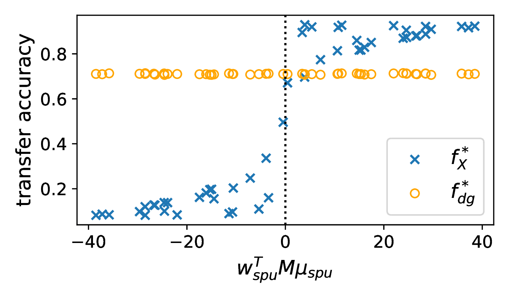
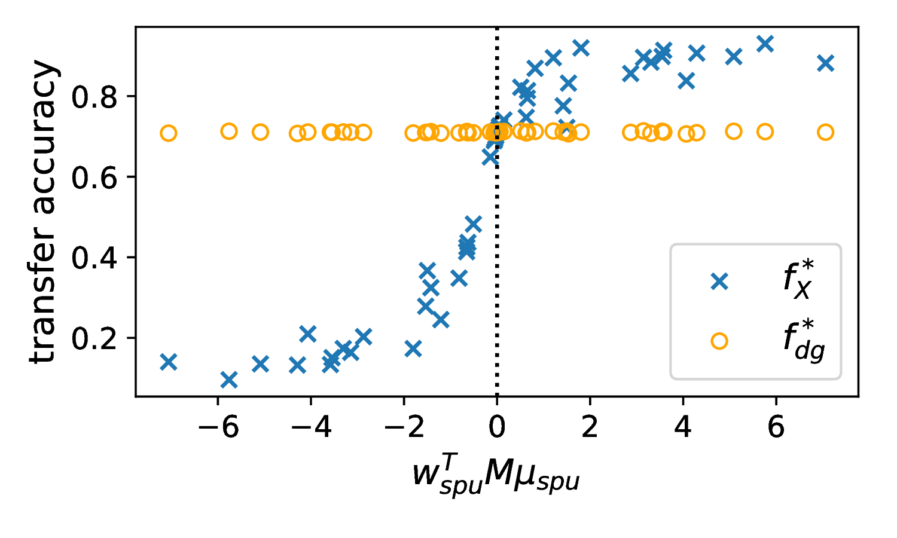

# Validating Domain Generalization Benchmarks

## Simulation Examples
### Generative Process
\[
\begin{aligned}
    Y &\sim \text{Bernoulli}(p) \\
    Z_{dg} &\sim \mathcal{N}\big((Y \oplus \eta_{dg})\cdot\mu_{dg}, \Sigma_{dg}\big) \\
    Z_{spu}^{ID} &\sim \mathcal{N}\big((Y \oplus \eta_{spu})\cdot\mu_{spu}, \Sigma_{spu}\big) \\
    Z_{spu}^{OOD} &\sim \mathcal{N}\big((Y \oplus \eta_{spu})\cdot(M\mu_{ood}), M^T\Sigma_{ood}M\big)
\end{aligned}
\]

### Transfer Accuracy vs. Shift
$w_{spu}^\top M \mu_{spu}$ denotes alignment between in-distribution spurious correlations ($w_{spu}$) and and out-of-distribution spurious correlations ($M \mu_{spu}$).

*Figure 1: All random variables are Gaussian. When conditions are satisfied OOD (x-axis), the $f_{dg}$'s outperform $f_X$'s OOD.*

*Figure 2: $\mathbf{Z_{spu}^{ID}}$ is defined to be an unconstrained mixture of 4 Gaussian distributions such that the test distributions cannot be written as mixtures of these 4 Gaussians. When Theorem~\ref{thm:gen_thm} conditions are satisfied OOD, the $f_{dg}$'s outperform $f_X$'s OOD.*

*Figure 3: $\mathbf{Z_{spu}^{ID}}$ is defined to be a mixture of 4 Gaussian distributions such that the test distributions can be written as mixtures of the 4 Gaussians. Overall, there is minimal difference in transfer accuracy between $f_{dg}$ and $f_X$ in this setting of domain interpolation.*

